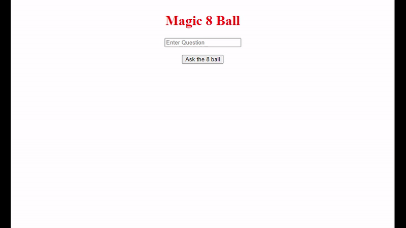

# Magic 8Ball Project 100Devs-Collab
Ever wanted your very own answer machine for any and every question you may have? The magic 8Ball solution has you covered!

**[Check it out](https://magic-8-ball-100devs-collab.herokuapp.com/)** live at Heroku!

## How It's Made:

**Tech used:** HTML, CSS, JavaScript, Nodejs

A collaboration project to create a backend API using Node.js as a platform. The client files, including html,css & javascript, are served to the user directly from the backend upon request to a default route. The user can then use a custom html form to input whatever question they desperately need answered. A linked asynchronous javascript function performs a http request to the 8Ball server which generates a response. A valid reponse is sent if the 8Ball server detects a question, otherwise the user is informed that a question must be asked of the 8Ball in order to get an answer.

## Optimizations
*(optional)*

Some additional information for the user if an invalid input is used would greatly enhance usability of the web application. Furthermore some additional visual styling such as a visual 8Ball image that shakes would have been preferrable to an input and button for querying and displaying responses.

## Lessons Learned:

This was a fantastic opportunity for various team members of varying skill levels to get together an collaborate in real-time using replit as a live editor. It offered an abundance of new challenges for each of us while we participated in tasks ranging from running ideation sessions for project, scoping of the problem-domain and delegating tasks to each team member.
